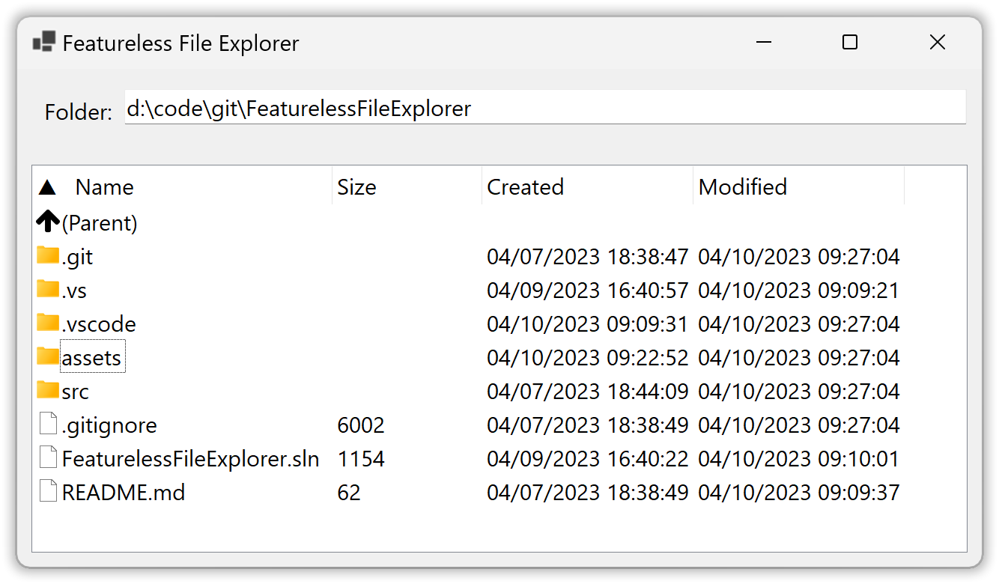
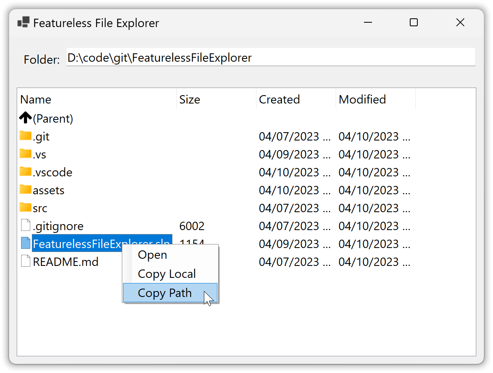

# FeaturelessFileExplorer
Barebones file explorer for Windows with as few features as possible to keep it simple.  

## Getting Started
1. Currently this is built against .NET 6, so make sure [that SDK](https://dotnet.microsoft.com/en-us/download/dotnet/6.0) is installed.  
2. Clone this repo
3. Run the application in one of two ways:
    1. In a command window running under the desired user account, CD to **src\FeaturelessFileExplorer** and then run `dotnet run`
    2. Open the solution with Visual Studio as the desired user, press F5 to start debugging the application
4. Type in the directory path and hit enter to view the files and folders in that directory

## Included Features
* List files and folders in any directory either locally or via UNC path
* Fast and responsive UI, no blocking
* Open any file using default app associated to the file's extension
* Copy any file locally
* Copy the path to any file to the clipboard
* Navigate up a directory tree
* Minimal lines of code that are very easy to read
* No 3rd party dependencies

## Features NOT Included
* Treeview, this added too much unnecessary complexity, this isn't supposed to replace Windows File Explorer
* Custom file and folder icons.  While pretty, in directories with many files and folders, this added considerable time as well as required Win32 Api calls which would have locked in the OS platform
* Different views are not allowed, it's Details view for everyone
* Any extra operations done on files and folders as part of the context menu or otherwise in Windows File Explorer; there are only 3 operations available to perform on files: Open, Copy Local and Copy Path, that's it

